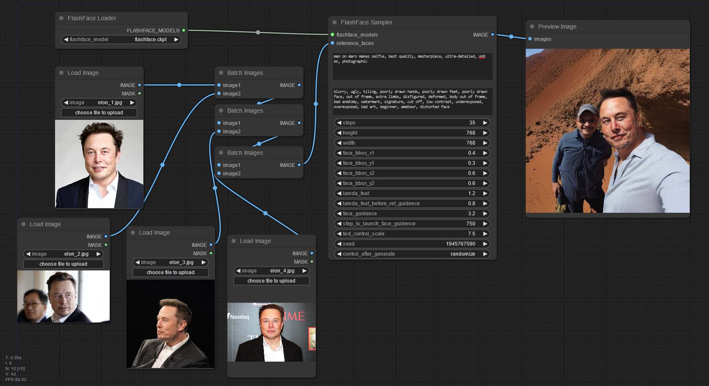

# ComfyUI-NuA-FlashFace
ComfyUI implementation of [FlashFace: Human Image Personalization with High-fidelity Identity Preservation](https://github.com/ali-vilab/FlashFace)

## Features
1. Zero-shot human image customization within seconds with one or several reference faces.
2. Strong identity preservation ability, even for non-celebrities
3. Strong language prompts following ability, even changing the age or gender of the person.
4. Flexible strength adjustment for identity image control and language prompt control.

## Installation
1. Clone the repository into the `ComfyUI/custom_nodes` directory

    ```sh
    cd ComfyUI/custom_nodes
    git clone https://github.com/nuanarchy/ComfyUI-NuA-FlashFace.git
    ```

2. Install the required modules

    ```sh
    pip install -r ComfyUI-NuA-FlashFace/requirements.txt
    ```

3. Copy the [model weights](https://huggingface.co/shilongz/FlashFace-SD1.5/tree/main) into the appropriate folders

    ```sh
    mkdir ComfyUI/models/flashface
    mkdir ComfyUI/models/face_detection
    wget -O ComfyUI/models/flashface/flashface.ckpt https://huggingface.co/shilongz/FlashFace-SD1.5/resolve/main/flashface.ckpt?download=true
    wget -O ComfyUI/models/vae/sd-v1-vae.pth https://huggingface.co/shilongz/FlashFace-SD1.5/resolve/main/sd-v1-vae.pth?download=true
    wget -O ComfyUI/models/clip/openai-clip-vit-large-14.pth https://huggingface.co/shilongz/FlashFace-SD1.5/resolve/main/openai-clip-vit-large-14.pth?download=true
    wget -O ComfyUI/models/clip/bpe_simple_vocab_16e6.txt.gz https://huggingface.co/shilongz/FlashFace-SD1.5/resolve/main/bpe_simple_vocab_16e6.txt.gz?download=true
    wget -O ComfyUI/models/face_detection/retinaface_resnet50.pth https://huggingface.co/shilongz/FlashFace-SD1.5/resolve/main/retinaface_resnet50.pth?download=true
    ```

4. Alternatively, you can use the `install.py` script to automate the setup process:

    ```sh
    cd ComfyUI/custom_nodes/ComfyUI-NuA-FlashFace
    python install.py
    ```
## Examples
In the `examples` folder, you will find the workflow diagram, the JSON file with the configuration, and four resulting images.

### Workflow Diagram



### Resulting Images
<table>
    <tr>
        <td></td>
        <td></td>
    </tr>
    <tr>
        <td></td>
        <td></td>
    </tr>
</table>


